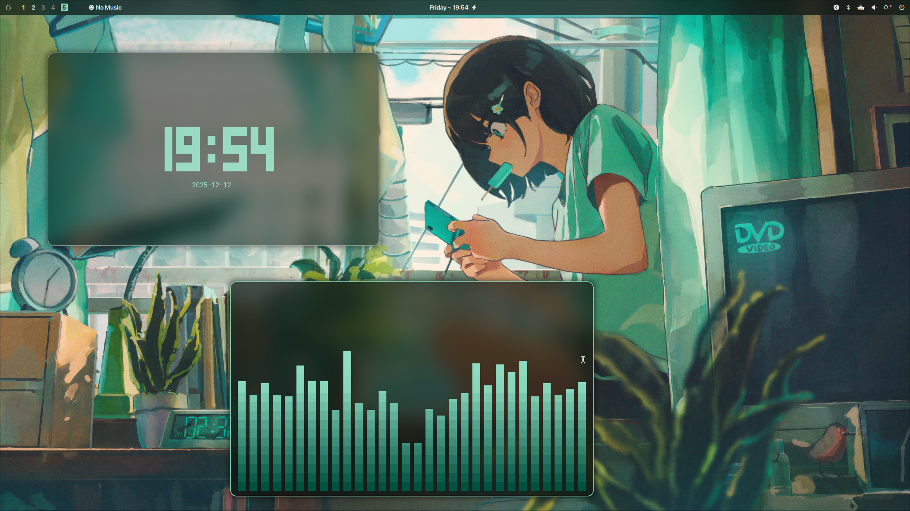
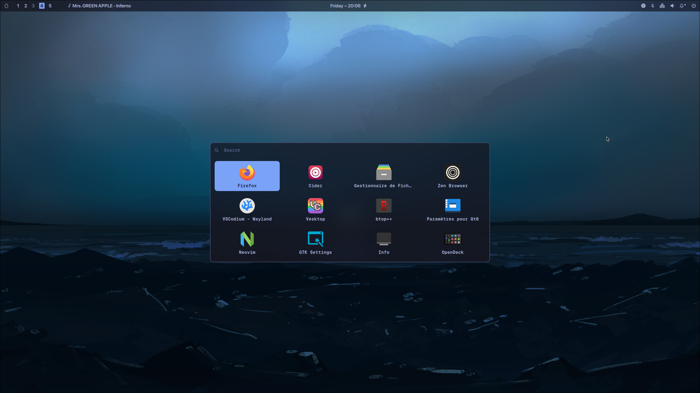
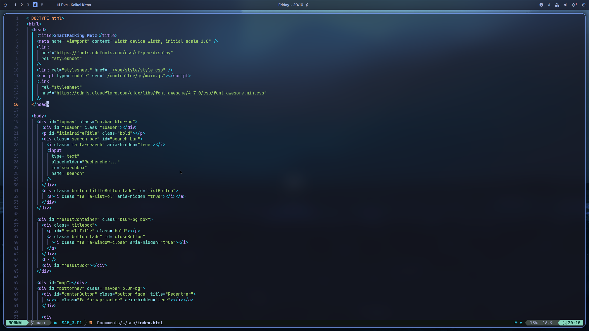
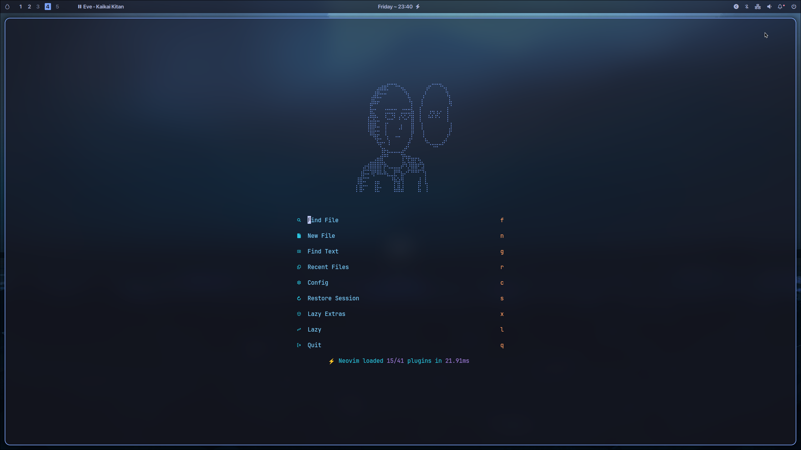

## 🚀 Features

- Unified CLI commands
- Unified Menu
- Profiles
- Themes Switcher
- Matugen
- Static themes
- Waybar Switcher
- Wallpapers Switcher
- FastFetch logo switcher
- Usefull scripts
- Neovim
- Auto Monitors Setup (you may change screen position)
- And more...

  ```
  hyprlab --help
  ```

## Requirements

- Hyprland and dependencies
- an Arch Distro (for now)

All other dependencies will be installed automatically.

## Installation

Run the command below :

```
curl -o install.sh https://raw.githubusercontent.com/Sash1ro/HyprLab/refs/heads/main/install.sh | sh
```

restart after the installation

The script will:

- Install missing dependencies

- Backup your existing configs

- Install the HYPERLAB configuration

- Set default themes

- Restart your graphical session (optional)

> [!CAUTION]
> ⚠️ My dotfiles are designed for me, you may need to adapt to your need.

## Preview

- Theme Switcher

https://github.com/user-attachments/assets/7f0d39b5-1801-48d1-a7ef-b60c9c42ea9a

- Rofi App launcher



- Neovim

 
